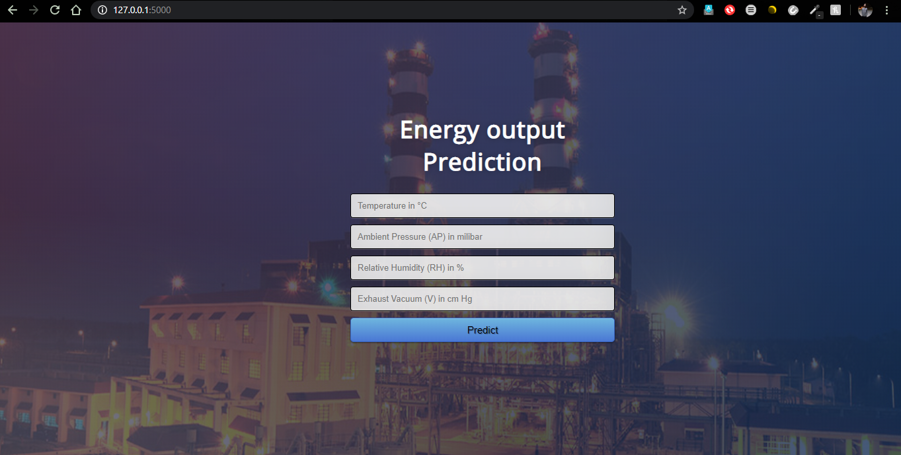

## A machine learning approach to predict hourly output of a power plant 
( https://output-from-power-plant.herokuapp.com/ )
In this project I have explored the data collected from a Combined Cycle Power Plant over 6 years.
Searched for the best machine learning algorithm to predict the output. 
Compared all the algorithms to get the best results.
Deployed the best model locally with flask.
___

### About data
The dataset contains 9568 data points collected from a Combined Cycle Power Plant over 6 years (2006-2011), when the power plant was set to work with full load. Features consist of hourly average ambient variables Temperature (T), Ambient Pressure (AP), Relative Humidity (RH) and Exhaust Vacuum (V) to predict the net hourly electrical energy output (EP) of the plant. A combined cycle power plant (CCPP) is composed of gas turbines (GT), steam turbines (ST) and heat recovery steam generators. In a CCPP, the electricity is generated by gas and steam turbines, which are combined in one cycle, and is transferred from one turbine to another. While the Vacuum is collected from and has effect on the Steam Turbine, the other three of the ambient variables effect the GT performance

**Attribute Information:**
Features consist of hourly average ambient variables

* Temperature (AT) in the range 1.81°C and 37.11°C,
* Ambient Pressure (AP) in the range 992.89-1033.30 milibar,
* Relative Humidity (RH) in the range 25.56% to 100.16%
* Exhaust Vacuum (V) in teh range 25.36-81.56 cm Hg
* Net hourly electrical energy output (PE) 420.26-495.76 MW 
* The averages are taken from various sensors located around the plant that record the ambient variables every second.

___
**Get the data here http://archive.ics.uci.edu/ml/datasets/Combined%20Cycle%20Power%20Plant**
___
### Inference
* The attributes Ambient Temperature , Ambient Pressure , Exhaust Vacuum directly influence the net hourly electric power output.
* The attribute Relative Humidity has comparitively less impact on net hourly electric power output.
___
### Deployment
Run these scripts in Anaconda prompt to run locally on your system.
~~~
$ set FLASK_APP=Deployment-flask-master\app.py
$ flask run
~~~

